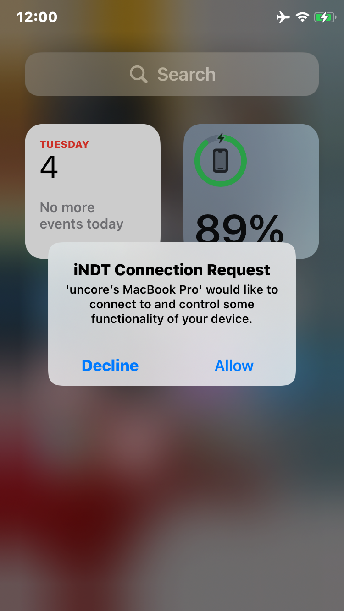
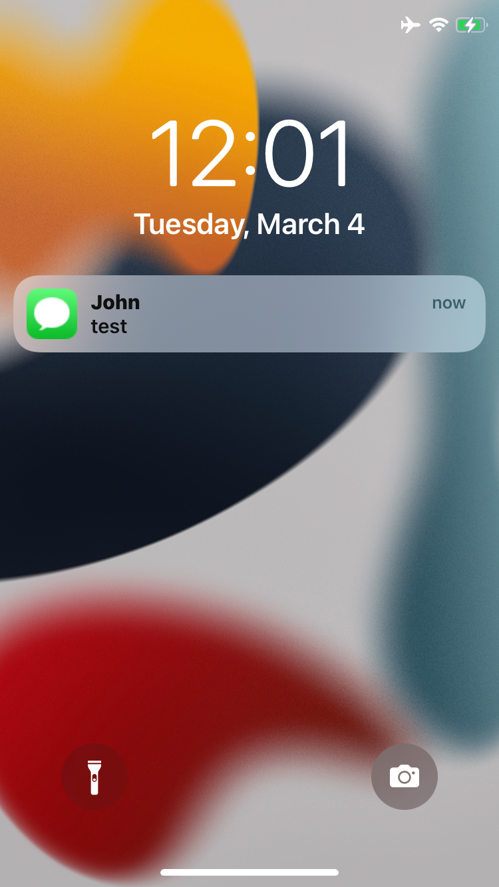

# iOS Notification Debugging Tools

A quick solution for sending notifications to jailbroken iOS devices for testing tweaks. Based on the MultipeerConnectivity framework.

It was written during an all-nighter while trying to make marketing images for a tweak so it is not written well (esp. serialization stuff). The UI is rudimentary, so feel free to improve if you can!

## Features

- Send notifications from your Mac to test
- Spoof your notification as from a bundle identifier
- Queue notifications on device at intervals for videos
- Clear already sent notifications
- Load notification lists from files
- No setup required after installation
- Spoof carrier name and time
- Relaunch SpringBoard remotely

## Get Started

Grab one of the deb files in releases (arm64 is for rootless, arm is for rootful), after installing the tweak download the Mac app from the releases page extract and run it.

### You are going to get this warning because it's not signed

    

### You have to right click and open it and then click on open again

    

### You should now be able to see iPhones on your network, simulator works as well

    

### Inviting the device will show a prompt on the device

    

### An example notification

    

### Will look like this

    

## Building from source

1. Build and install tweak on device with `make install` (Theos required)
2. Open `Mac app/iOS Notification Debugging Tools.xcodeproj`
3. Run the Xcode project to build the Mac app

### Thanks [Ayden](https://github.com/aydenp) for the tweak

## Contributing

Please feel free to improve the tool as much as you'd like and pull request back. Attempt to maintain a readable and similar coding style and use the same conventions as present already.
